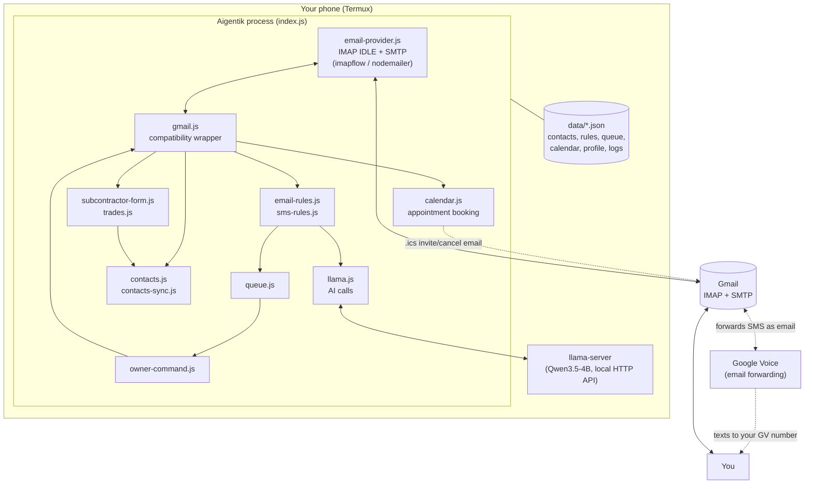

> [← Back to README](../README.md) · [All documentation](README.md)

# Architecture

How Aigentik is put together: the process model, the two channels everything flows through, and what happens to a message step by step.

## Table of Contents

- [How it's built](#how-its-built)
- [The two communication channels](#the-two-communication-channels)
  - [Email](#email)
  - [Google Voice (via Gmail)](#google-voice-via-gmail)
- [Who Aigentik listens to as "the owner"](#who-aigentik-listens-to-as-the-owner)
- [What happens to an incoming email, step by step](#what-happens-to-an-incoming-email-step-by-step)
- [What happens to an incoming Google Voice text, step by step](#what-happens-to-an-incoming-google-voice-text-step-by-step)
- [Dynamic role & workflow routing](#dynamic-role--workflow-routing)
- [Source file reference](#source-file-reference)

## How it's built

Everything after "Gmail" is one long-lived Node.js process (`index.js`) with a single IMAP connection sitting in `IDLE`, plus a small pool of extra IMAP connections opened only for bulk operations (delete/archive/spam-scan/search) so they don't block the main inbox watcher. All AI calls are plain HTTP requests to `llama-server` running on `127.0.0.1:8080` — nothing goes further than that unless it's actual mail traffic to Gmail's IMAP/SMTP servers. Appointment scheduling (`calendar.js`) works the same way: no calendar API, no OAuth — bookings reach real calendars as standards-based `.ics` invite emails sent over that same SMTP connection (see [Appointment scheduling](scheduling.md)). Natural-language date/time phrases are resolved deterministically by `chrono-node`, not guessed by the local model.

## The two communication channels

Aigentik has exactly two ways in and out: **Gmail**, and **Google Voice through Gmail**. There is no direct SMS sending or receiving on the device itself — an earlier version of this project did poll and send SMS directly through Termux:API, but that entire path (`sms-send.js`, `sms-inbox.js`, `sms-public.js`, and a first-run setup wizard built on it) has been removed, because it had no way to work consistently with the "everything through Gmail" design and there's no way to originate a brand-new, unprompted text message through Google Voice's email interface anyway (only *replying* to an existing forwarded thread works by email).

**Practical effect:** Aigentik can reply to a Google Voice text once it's arrived, but it cannot start a new, out-of-the-blue text conversation with someone who hasn't texted the Google Voice number first. If you ask it to "text Mom hi", it will tell you it can't and suggest emailing her instead.

### Email

Handled by `email-provider.js` (the actual IMAP/SMTP client, built on `imapflow` and `nodemailer`) and `gmail.js` (a thin compatibility wrapper other modules import from, so nothing else needs to know `imapflow` exists). One connection stays in `IDLE`; the moment Gmail reports the message count went up, Aigentik fetches whatever's unseen, marks it seen by its exact IMAP UID, and hands each parsed message to `index.js`'s `handleNewEmail`.

A few things about this that matter if you're debugging behavior:

- **Only mail received after Aigentik started is processed.** The startup timestamp is recorded once at boot; anything already unread in the inbox from before that is skipped, so restarting Aigentik never triggers a flood of replies to old mail.
- **Sending never blocks receiving.** New-mail handling and any bulk management operation (delete/archive/spam-scan) go through separate IMAP connections, so a long "scan and spam promotional mail" pass doesn't stall the live inbox watch.
- **A new-mail check never runs twice at once.** If two mailbox changes land close together (for instance, your own reply landing back in the inbox right after being sent, immediately followed by a real new message), the second check waits for the first to finish rather than running concurrently against the same connection.

### Google Voice (via Gmail)

Google Voice doesn't give this project any direct API access — instead, it forwards every incoming text as an email (from an address under `txt.voice.google.com`) into the same Gmail inbox Aigentik is already watching. `email-provider.js` recognizes these by their subject line format ("New text message from ...") and parses them into an SMS-shaped object: sender name, sender phone number, message body, and — critically — the original forwarding email's address and subject, which is what makes it possible to *reply* later (Aigentik replies to that forwarded email; Google Voice turns the reply back into a real text on the wire).

## Who Aigentik listens to as "the owner"

Two things are treated identically as "a command from the owner, not a message to auto-reply to":

1. **A Google Voice text from `owner.admin_number`** (checked against the last 10 digits, so formatting doesn't matter).
2. **An email from `owner.admin_email`**, sent directly to the Gmail account Aigentik monitors.

Both get built into the same lightweight shape (`{ address, body, _id }`) and handed to `owner-command.js`'s `handleOwnerCommand`, so every command in the [command reference](commands.md) works identically from either channel.

For the email path specifically: if you reply to one of Aigentik's own notification emails instead of composing a fresh one, Gmail will append the old message underneath yours, quoted, with an "On [date], Aigentik wrote:" header. Aigentik strips that quoted block (and any `-----Original Message-----` or `>`-quoted block) before treating the remainder as your command, so the leftover quoted text doesn't get fed into the interpreter along with your actual instruction.

## What happens to an incoming email, step by step

1. **IMAP IDLE fires.** `email-provider.js` fetches the new message(s), marks each seen by UID, and calls back into `index.js` with the parsed email.
2. **Sender check.** If it's from Aigentik's own address, it's ignored (this is what stops "I sent myself a copy" or notification loops). If it's a Google Voice forwarded text, it's routed to the Google Voice handler instead (see below). If it's a subcontractor application lead-form (`subcontractor-form.js`'s `isSubcontractorApplication`), it's routed to its own handler — parsed deterministically, saved as a `type: "subcontractor"` contact, and acknowledged with a subcontractor-specific reply, never the customer flow below (see [The contact directory](contacts.md)). If it's from `admin_email`, it's routed to the owner-command handler instead (see above). Otherwise, it's a normal inbound email and processing continues.
3. **Contact lookup.** `contacts.findOrCreateByEmail` either finds the sender in the contact directory or creates a new entry, and a history entry is recorded against it.
3a. **Do-not-contact check.** `do-not-contact.js`'s `isBlocked` is checked against the sender's address; if they're already on the list, processing stops right here — no reply, no queue entry, just a report to `admin_email` noting they reached out anyway. If they're not yet blocked, the body is checked for opt-out phrasing ("stop emailing me", "remove me from your list", etc. — matched deterministically, not by the model); a match adds them to the list on the spot and reports it to the admin, before any reply is ever drafted. See [The do-not-contact list](commands.md#do-not-contact-list).
4. **Rule check.** `email-rules.js` checks the sender, subject, and body against your saved rules, in order, first match wins. If nothing matches, the configured default (`behavior.default_unmatched_action`, normally `auto-reply`) applies. See [Rule engines](rules.md).
5. **If the rule action is `spam`**, the sender's mail is moved to Gmail's Spam folder and nothing else happens.
5a. **Scheduling check.** Unless the message is a fresh scheduling request from a known subcontractor (see below), `handleSchedulingMessage` checks for an in-flight negotiation/reschedule first, then classifies fresh messages via `llama.classifySchedulingIntent`; if it's a scheduling request it's handled entirely here (propose/confirm/cancel/reschedule an appointment) and normal reply generation is skipped. See [Appointment scheduling](scheduling.md).
6. **Role & workflow classification.** `role-router.js` resolves the sender into a `person` (identity plus any known subcontractor/customer CRM record and accumulated `roles`) and classifies the message's role/intent/workflow (`resolvePersonAndRoles` + `detectRoleAndIntent`) — deterministically first (opt-out, emergency keywords, dual-intent and ambiguous-phrasing pattern matches), falling back to an LLM classification call for anything not caught by a pattern. A message that reads as belonging to neither a customer nor a subcontractor gets an `AMBIGUOUS_CLARIFICATION` reply asking which one applies, instead of guessing. The resulting workflow decides which reply path runs next: `SUBCONTRACTOR_RECRUITMENT`/`SUBCONTRACTOR_ACTIVE` routes through `subcontractor-recruiter.js`'s qualification flow, `CUSTOMER_INTAKE_SALES`/`CUSTOMER_SUPPORT` routes through `customer-module.js`'s intake/emergency/escalation flow, and anything else falls back to a plain AI reply via `llama.js`'s `generateEmailReply`. `updatePersonRolesAndState` then persists any newly detected role onto the contact's `roles`/`active_role` (see [The contact directory](contacts.md)) without touching `type`.
7. **Auto-reply or queue.** If the rule (or the default) says `auto-reply`, the draft is sent immediately via `gmail.sendReply`, and you get a short notification email confirming what was sent. Otherwise, the draft is pushed onto the review queue with a numbered `display_id`, and you get a notification with the draft and a `reply [#]` prompt. See [The review queue](commands.md#the-review-queue).

## What happens to an incoming Google Voice text, step by step

1. Steps 1–2 above are shared — it arrives as email, gets parsed, and is recognized as a Google Voice message before the "regular email" path ever runs.
2. **Sender check.** If the *sender's phone number* matches `admin_number`, it's a command — handed to `owner-command.js` exactly like an admin email (see above). Otherwise, it's a public message and continues below.
3. **Contact lookup and history**, same as email.
4. **Urgent-keyword check.** If the message body contains your name (`owner_name`, from `profile.json`), you get a separate 🚨 urgent notification regardless of anything else that happens.
5. **Contact behavior check.** If you've told Aigentik to "never reply" to this contact, processing stops here.
6. **Rule check**, via `sms-rules.js` — by phone number, message content, or both. `spam` short-circuits the same way it does for email.
6a. **Scheduling and role/workflow classification**, same as email (steps 5a–6 above) — a fresh appointment request from a known subcontractor is skipped in favor of the subcontractor flow, an in-flight negotiation always wins, and otherwise `role-router.js` decides between the subcontractor, customer, or plain-reply path (`generateSmsReply` — shorter and more casual than the email version, with its own signature — for anything that isn't one of those).
7. **Auto-reply or queue**, same shape as email: either `gmail.replyToGoogleVoiceText` sends it immediately (which Google Voice turns back into a real SMS), or it's queued with the forwarding email's address and subject saved alongside it, so a later manual approval can still reply correctly.

## Dynamic role & workflow routing

Step 6/6a above (email/SMS) is `role-router.js` deciding *which* conversation this message belongs to. It runs in two calls:

1. **`resolvePersonAndRoles`** builds a `person`: the matching contact record (if any), the linked subcontractor/customer CRM record (`subcontractor-recruiter.js`'s `findSubcontractor` / `customer-module.js`'s `findCustomer`), the accumulated `roles` array, and an `active_role`. A contact with no CRM record and no `roles` yet defaults to `CUSTOMER` rather than `OTHER` — an unknown sender is assumed to be a prospective homeowner until something says otherwise.
2. **`detectRoleAndIntent`** classifies the message itself against that person, checked in order: an opt-out/DNC phrase short-circuits to `do-not-contact.js` immediately; an emergency keyword forces the customer workflow regardless of the sender's known role; a message that reads as both a customer project and a subcontractor pitch in the same breath is flagged `DUAL_INTENT_CUSTOMER_AND_SUB`; a handful of regex patterns catch genuinely ambiguous phrasing ("I do roofing and need some information") and return `AMBIGUOUS_CLARIFICATION` instead of guessing; failing all of those, a subcontractor-language or customer-language pattern match decides it deterministically; and only a message that matches none of the above falls through to an LLM classification call (`classifyWithLLM`) for a plain-language verdict.

The result decides which module handles the reply — [`subcontractor-recruiter.js`](subcontractor-recruitment.md) for `SUBCONTRACTOR_RECRUITMENT`/`SUBCONTRACTOR_ACTIVE`, [`customer-module.js`](customer-crm.md) for `CUSTOMER_INTAKE_SALES`/`CUSTOMER_SUPPORT`, an ambiguity-clarification reply asking which one applies, or a plain AI reply for anything else — and `updatePersonRolesAndState` then folds any newly detected role into the contact's `roles`/`active_role` fields (see [The contact directory](contacts.md)) without touching `type`, since role membership and contact `type` are tracked separately on purpose (a subcontractor who also becomes a customer shouldn't disappear from `findSubcontractorsByTrade` results).

A sender already routed to `owner-command.js` (an admin text/email — see above) never reaches role-router at all; there's no admin-detection branch here to bypass.

## Source file reference

| File | Role |
|---|---|
| `index.js` | Entry point: starts `llama-server`, warms it up, loads the profile, kicks off contact sync, connects Gmail, and routes every incoming email to the right handler |
| `email-provider.js` | The actual IMAP/SMTP client — connection lifecycle, IDLE loop, reconnection with backoff, message parsing, send/delete/archive/spam/search operations, Google Voice email parsing, `.ics` calendar invite/cancellation building and sending |
| `calendar.js` | The appointment calendar: working-hours/duration config, slot-finding, booking/reschedule/cancel, and deterministic (`chrono-node`-backed) natural-language date/time-range parsing |
| `gmail.js` | Thin compatibility wrapper around `email-provider.js` so the rest of the app has a stable, simple API |
| `owner-command.js` | Parses and executes every owner command, whether it arrived via Google Voice text or admin email |
| `llama.js` | All calls to the local model: email/SMS reply generation, natural-language command interpretation, contact-detail and freeform-subcontractor-detail extraction, subcontractor application acknowledgment replies, tone detection, general content generation |
| `email-rules.js` | The email rule engine, plus the promotional-content detector used by both rule matching and `spam all promotional` |
| `sms-rules.js` | The Google Voice rule engine |
| `contacts.js` | The contact directory: lookup, create, update, history, per-contact instructions, subcontractor trade/license/insurance fields and lookup-by-trade, plus the accumulating `roles`/`active_role` fields `role-router.js` maintains |
| `contacts-sync.js` | One-way merge of Android's real contact list into `contacts.json` |
| `role-router.js` | Resolves an inbound sender into a `person` (identity, known CRM records, accumulated roles) and classifies each message's role/intent/workflow — deterministic pattern matching first, an LLM call as fallback — deciding whether it routes to the subcontractor flow, the customer flow, an ambiguity-clarification reply, or a plain AI reply |
| `subcontractor-recruiter.js` | The subcontractor CRM — see [Subcontractor recruitment pipeline](subcontractor-recruitment.md): lead creation/lookup, qualification-status/next-step state machines, and qualification-detail extraction for the recruitment conversation flow |
| `customer-module.js` | The customer CRM — see [Customer intake, sales & support CRM](customer-crm.md): intake/sales-qualification record creation/lookup, lead scoring, and emergency/escalation keyword detection |
| `subcontractor-form.js` | Detects and deterministically parses "Subcontractor Application" lead-form emails into trade/license/insurance/crew/references |
| `trades.js` | Canonical trade taxonomy and synonym normalization (e.g. "electrician" → `electrical`), shared by `contacts.js` and `subcontractor-form.js` |
| `queue.js` | The review queue: add, fetch, edit, remove, format for display |
| `do-not-contact.js` | The permanent contact-suppression list, stored in Restoricon Core (no local-JSON fallback since the B2 write-through cutover): add/remove/lookup by email or phone over the Core API, plus deterministic detection of opt-out phrases ("stop texting me", "remove me from your list") in an inbound message |
| `tone.js` | Wraps `llama.js`'s tone detection with a fallback and tone-to-instruction mapping used in SMS reply prompts |
| `logger.js` | Structured JSON file logging plus console mirroring |

---

[← Back to README](../README.md) · [All documentation](README.md)
